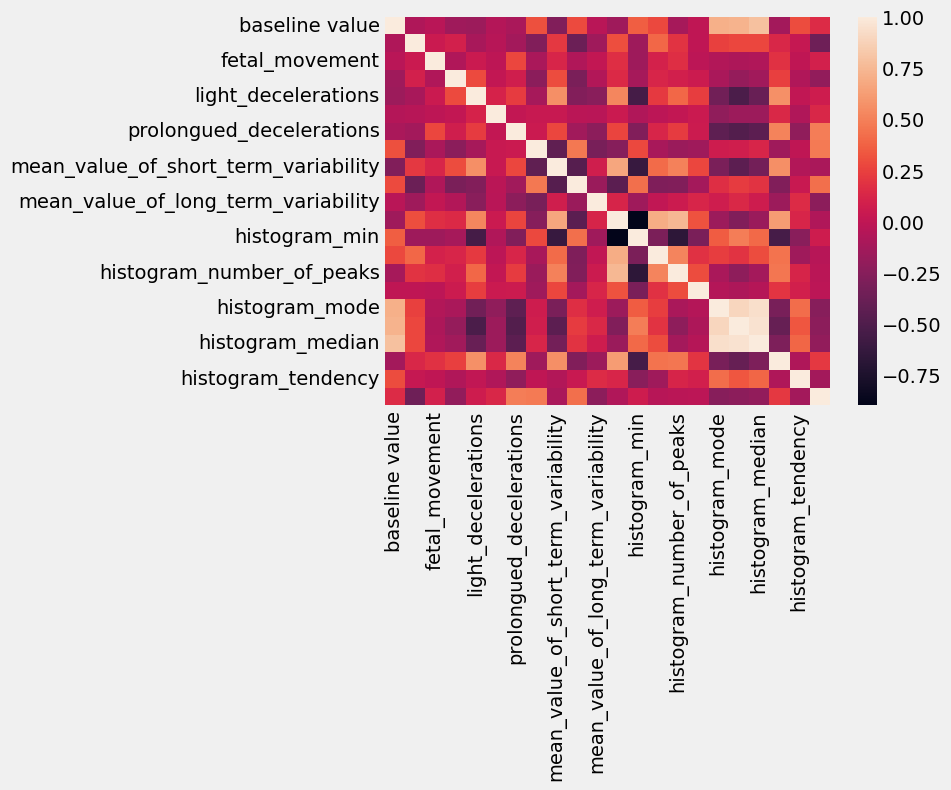
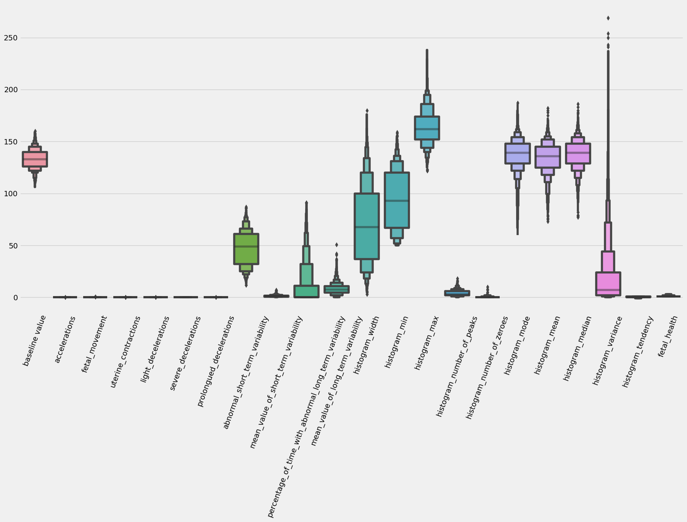
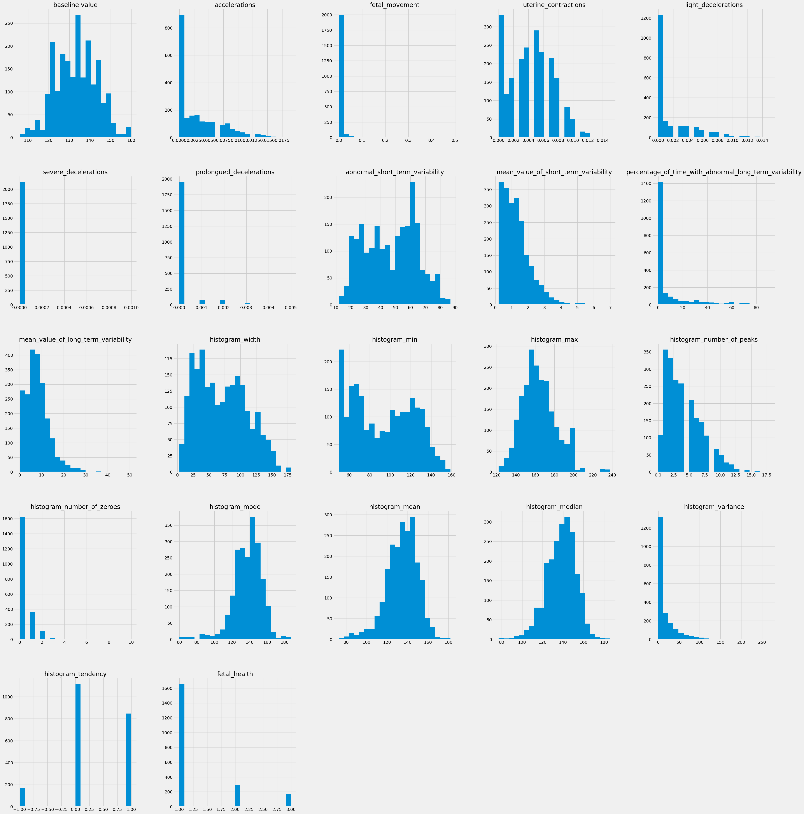

# Fetal Health Classification — EDA + Cookiecutter Scaffold

Exploratory data analysis of the Kaggle Fetal Health Classification dataset (cardiotocogram features), scaffolded with the Cookiecutter Data Science layout in preparation for a multi-class classifier.

> **Status: WIP, EDA-only.** This repo loads the raw CTG data, profiles features, inspects class imbalance, and standardizes the numeric columns. **No classifier has been trained yet.** I'm being upfront about that — the project is a foundation, not a finished model.



---

## Why fetal health classification

Cardiotocography (CTG) is the standard pre-labour fetal monitoring tool — it traces fetal heart rate and uterine contractions during the third trimester and intrapartum. A clinician reads the trace and decides whether the fetus looks **Normal**, **Suspect**, or **Pathological**. Misreading a Pathological as Normal can mean a missed emergency C-section. Misreading a Normal as Pathological can mean an unnecessary intervention. CTG interpretation has measurable inter-rater disagreement, which is exactly the kind of problem ML *should* be able to help with — **as a second opinion, not a replacement**.

The Kaggle Fetal Health Classification dataset has ~2,126 CTG exams labeled Normal / Suspect / Pathological by expert obstetricians, with 22 derived features (heart-rate accelerations, decelerations, variability metrics, histogram-based summaries). It's one of the cleaner public medical datasets — small, but the features are clinically meaningful.

## What this project is (and isn't)

**It is:**
- A Cookiecutter Data Science scaffold so the project can grow into a real ML codebase.
- A complete EDA pass: profiling, class-balance inspection, correlation heatmap, distribution plots, scatter plots for candidate feature pairs.
- A prototyped preprocessing step (StandardScaler) ready to drop into a modeling pipeline.

**It isn't:**
- A trained classifier. There's no `model.pkl`, no inference script, no metrics on a held-out set. That's deliberate — I'd rather ship the EDA cleanly and add the model in the next iteration than half-finish both.
- Production-ready or clinically validated. It's a portfolio project on a 2,126-row Kaggle dataset. I'd never trust this for actual clinical use, and the README should say so.

## Why Cookiecutter Data Science

[Cookiecutter Data Science](https://drivendata.github.io/cookiecutter-data-science/) is "right enough" for small ML projects — opinionated folders for `data/raw`, `data/interim`, `data/processed`, `data/external`, plus `notebooks/`, `models/`, `reports/figures/`, `src/`, and a `docs/` scaffold. It costs almost nothing upfront and pays off the moment the project grows past one notebook. The discipline of `data/raw` being read-only and `data/processed` being everything-derived is the most important habit in applied ML — once you confuse "the original CSV from Kaggle" with "the version I cleaned last Tuesday", you've lost reproducibility.

For a project that's meant to grow into a trained classifier, the scaffold is worth more than the few minutes it costs to set up. Future me will thank current me when the scope expands and there's already a `models/` folder waiting.

## Current state — what's done

Everything in `notebooks/data_eda.ipynb`:

- `info()` and `describe()` profiling — confirms 2,126 rows, 22 numeric features, no nulls.
- `value_counts()` on the target column — class balance check.
- `seaborn.heatmap` of `raw_data.corr()` — the correlation matrix.
- `boxenplot` across all features — highlights scale differences and heavy tails.
- Per-column histograms (raw and post-scaling) — confirms skew and validates the StandardScaler step.
- Scatter plots for candidate feature pairs (e.g. `abnormal_short_term_variability` vs `mean_value_of_long_term_variability`).
- `StandardScaler` fit-transform across all numeric columns, with re-plotted histograms confirming unit-variance distributions.

The representative preprocessing step:

```python
from sklearn.preprocessing import StandardScaler
scaler = StandardScaler()
scaled_data = pd.DataFrame(
    scaler.fit_transform(raw_data),
    columns=raw_data.columns,
)
scaled_data.hist(bins=22, figsize=(40, 45))
```

Stack: `pandas`, `numpy`, `seaborn`, `matplotlib`, `scikit-learn`.

## Class imbalance — the headline observation

```
Normal        ~78%
Suspect       ~14%
Pathological  ~ 8%
```

This is the most important EDA finding and it shapes everything downstream. The classes I most want to detect — Suspect and Pathological — are the rarest. A naive classifier that always predicts Normal hits ~78% accuracy and is completely useless. So the model is going to need:

- **Stratified train/test split** so each class is represented proportionally.
- **Class weights** in the loss function (or SMOTE-style oversampling on the training set only — never on test).
- **Non-accuracy metrics** — macro-F1, per-class recall, ROC-AUC per class. Accuracy is the wrong target on this dataset.
- A **threshold-tuned decision rule** rather than `argmax`, so the operating point can be picked by clinical priorities (e.g. high-recall for Pathological is more important than high precision).

## Feature observations

From the correlation heatmap and the scatter plots:

- **Heart-rate variability metrics** (`abnormal_short_term_variability`, `mean_value_of_short_term_variability`, `percentage_of_time_with_abnormal_long_term_variability`) cluster together and correlate most strongly with the Pathological class. That tracks with clinical literature — variability loss is a recognized distress signal.
- **Histogram-based features** (`histogram_width`, `histogram_min`, `histogram_max`, `histogram_mean`, etc.) span a much wider value range than the variability metrics. Without scaling, distance-based or gradient-sensitive models would be dominated by histogram features just because of their numeric range. StandardScaler fixes this.
- A handful of features show heavy right-skew. For tree-based models this is harmless; for logistic regression I'd consider a log transform on the worst offenders.

## Key screenshots

| | |
|---|---|
|  |  |
| Boxen plot of all 22 CTG features — highlights scale differences and heavy tails | Raw histograms — right-skew and differing ranges confirm scaling is needed |
|  | |
| Same histograms after `StandardScaler` — unit-variance, centred on zero, ready for modeling | |

## What I'm going to build next

In rough order:

1. **XGBoost baseline.** Tree-based, handles unscaled features fine, robust to skew, handles class weights cleanly. The right "first model" on tabular data with imbalance.
2. **SHAP explanations** on the XGBoost model. Medical models *must* be explainable. A clinician needs to be able to ask "why does this model say Suspect?" and get a per-feature attribution. SHAP values give that. LIME would also work but SHAP has stronger theoretical guarantees on consistency.
3. **Calibrated logistic regression** as a "second opinion" model. Different inductive bias from XGBoost; if both flag the same case as Pathological, that's a stronger signal than either alone. I'd use isotonic or Platt calibration to make the predicted probabilities trustworthy.
4. **Model card** documenting intended use, training data, performance per class, known failure modes, and explicit "not for clinical use" framing.

## Why interpretability matters here, specifically

In a domain like e-commerce churn, a black-box model is annoying but tolerable — if it's wrong, somebody gets a coupon they didn't need. In CTG interpretation, a black-box model is a *liability*. A radiologist or obstetrician will not trust a "the model said so" recommendation, and they shouldn't. The clinical workflow needs the model to surface *which features drove the prediction* — was it the absent accelerations, the prolonged decelerations, the loss of variability? — so the clinician can sanity-check the reasoning against the actual trace.

If I were building this for production deployment (which I am not), the design constraint would be: every prediction comes with a SHAP waterfall. Every confident prediction surfaces the top three contributing features. Every borderline prediction triggers an "ambiguous, recommend manual review" pathway. That's the only way an ML system earns its way into a clinical workflow.

## What I learned from the EDA alone

- **CTG data has genuine overlap between Suspect and Pathological** — the model won't be a clean linear-decision-boundary problem. There are exams that human experts disagree on; the model will inherit that disagreement.
- **StandardScaler is essential** when your features span accelerations (small) and histogram widths (large). Distance-based and gradient-based models will fail on raw scales.
- **I wouldn't trust a 2,126-sample model for clinical use.** It's a portfolio project, not a product. Real clinical ML needs tens of thousands of labeled exams, multi-site validation, and prospective testing — none of which is feasible from a single Kaggle dataset.

## How to run

```bash
git clone https://github.com/ChetanSarda99/fetal-health-classification.git
cd fetal-health-classification
pip install pandas numpy seaborn matplotlib scikit-learn jupyter
jupyter notebook notebooks/data_eda.ipynb
```

The raw CSV is already in `data/raw/fetal_health.csv` (from the Kaggle "Fetal Health Classification" dataset).

> Note: the notebook currently has a hardcoded Windows path (`C:\Users\sarda\...`). Replace it with `'../data/raw/fetal_health.csv'` before running. The next iteration switches everything to `pathlib` + a relative `data/` path.

## File structure

```
.
├── data/
│   ├── raw/fetal_health.csv   # Kaggle source (2,126 CTG exams, 22 features, 3-class label)
│   ├── interim/               # (empty) intermediate cleaned data
│   ├── processed/             # (empty) final modeling-ready data
│   └── external/              # (empty) third-party data
├── notebooks/
│   ├── data_eda.ipynb         # Profile, correlate, plot, StandardScaler-transform
│   └── inital_file.ipynb      # Placeholder stub (will be removed)
├── models/                    # (empty) trained model artefacts will live here
├── reports/figures/           # (empty) plots exported from the notebooks
├── screenshots/               # EDA visuals used in this README
├── docs/                      # Sphinx documentation scaffold
└── README.md                  # This file
```

## What's next

- Train the XGBoost baseline with class weights + stratified CV.
- Run SHAP, generate per-class summary plots and a few representative waterfall plots.
- Try a calibrated logistic regression as a second-opinion model.
- Write the model card.
- Switch the notebook to `pathlib` + a relative `data/` path so anyone can clone-and-run.

## Author

Chetan Sarda — [github.com/ChetanSarda99](https://github.com/ChetanSarda99)
